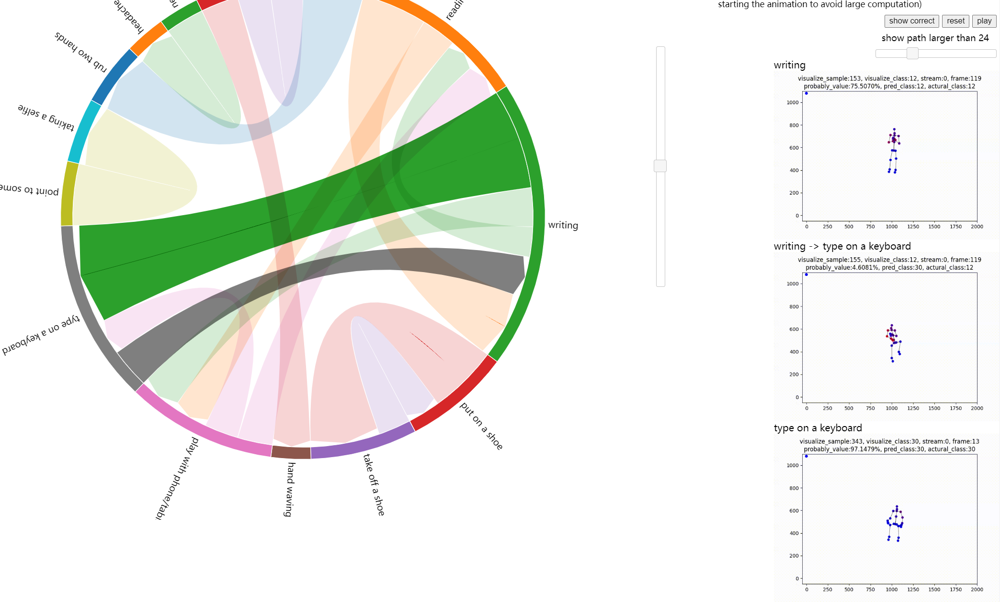

# skeleton-based action recognition evaluation data visualization

see `report.pdf` for design and usage details

[online demo](https://guojj33.github.io/skeleton-vis)

- re-implement [marching ants](https://vizgroup.github.io/activateviz/#:~:text=Marching%20Ants) effect
  

- show skeleton sample
  